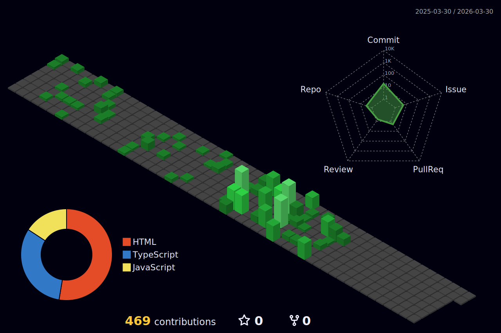

# Привет, я Денис!

## О себе
<table border="0px">
  <tr>
    <td width="30%" valign="top">
      Привет! Я разработчик, находящийся на пути становления в Fullstack-разработке.
    </td>
    <td width="70%" height="400px" align="center">
      
    </td>
  </tr>
</table>

## ? Текущие проекты
– **Платформа аналитики данных** — разрабатываю масштабируемое решение для анализа больших данных с использованием Python и Apache Spark.
– **API Gateway Service** — создаю централизованный шлюз для микросервисной архитектуры на FastAPI.
– **Data Processing Library** — участвую в разработке open-source-библиотеки для эффективной обработки и валидации данных.
– **Tech Blog** — веду технический блог о бэкенд-разработке и DevOps-практиках.

## 🛠️ Технологический стек

### Frontend

### Backend

### Testing & Quality

### Tools & Libraries

## 📊 GitHub Analytics

## Технический стек
- JavaScript, TypeScripto
- PostgreSQL, Redis
- Docker
- CI/CD, GitHub Actions
- Apache Spark
- Микросервисная архитектура
- Data Processing
- DevOps

## ? Контакты
- Email: rustam@example.com
- LinkedIn: linkedin.com/in/rustam_example
- Telegram: @rustam_dev_example
